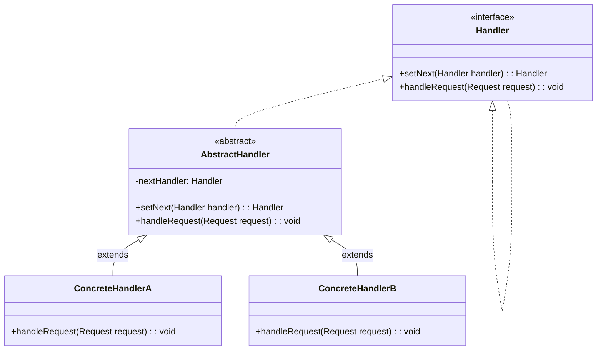

# 责任链模式

责任链是由很多责任节点串联起来的一条任务链条，其中每一个责任节点都是一个业务处理环节。责任链模式(Chain of Responsibility)允许业务请求者将责任链视为一个整体并对其发起请求，而不必关心链条内部具体的业务逻辑与流程走向，也就是说，请求者不必关心具体是哪个节点起了作用，总之业务最终能得到相应的处理。在软件系统中，当一个业务需要经历一系列业务对象去处理时，我们可以把这些业务对象串联起来成为一条业务责任链，请求者可以直接通过访问业务责任链来完成业务的处理，最终实现请求者与响应者的解耦。

责任链模式的本质是处理某种连续的工作流，并确保业务能够被传递至相应的责任节点上得到处理。当然，责任链也不一定是单一的链式结构，我们甚至可以让一位审批人将业务传递给多位审批人，或是加入更复杂的业务逻辑以完善工作流，最终使不同的业务有不同的传递方向。对责任链模式的应用让我们一劳永逸，之后我们便可以泰然自若地应对业务需求的变更，方便地对业务链条进行拆分、重组，以及对单独节点的增、删、改。结构松散的业务处理节点让系统具备更加灵活的可伸缩性、可扩展性。责任链模式让申请方与处理方解耦，申请人可以彻底从业务细节中解脱出来，无论多么复杂的审批流程，都只需要简单的等待，让业务在责任链上飞一会儿。

在本例中，假设我们正在开发一个游戏。游戏中有多种类型的敌人，包括僵尸、骷髅和蝙蝠。当玩家攻击敌人时，游戏需要确定攻击的是哪个敌人并施加适当的伤害。要处理这种情况，可以使用责任链模式。可以创建一个 AttackHandler 对象链，其中链中的每个处理程序都能够处理攻击请求或将其传递给链中的下一个处理程序。链中的第一个处理程序将接收攻击请求并确定哪种类型的敌人受到攻击。如果第一个处理程序可以处理攻击，它将应用适当的损坏并且链将结束。如果第一个处理程序无法处理攻击，它将把它传递给链中的下一个处理程序，依此类推。这个过程将一直持续到攻击被处理或者链中没有更多的处理程序。

## UML

