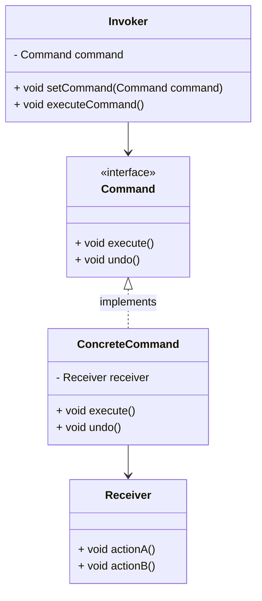

# 命令模式
命令是一个对象向另一个或多个对象发送的指令信息。命令的发送方负责下达指令，接收方则根据命令触发相应的行为。作为一种数据（指令信息）驱动的行为型设计模式，命令模式(Command)能够将指令信息封装成一个对象，并将此对象作为参数发送给接收方去执行，以使命令的请求方与执行方解耦，双方只通过传递各种命令过象来完成任务。

读者应视具体情况而定，不要顾此失彼。命令模式其实与策略模式非常类似，只不过前者较后者多了一层封装，命令接口的统一确立，使系统可以忽略命令执行方接口的多样性与复杂性，将接口对接与业务逻辑交给具体的命令去实现，并且实现命令的无限扩展。

