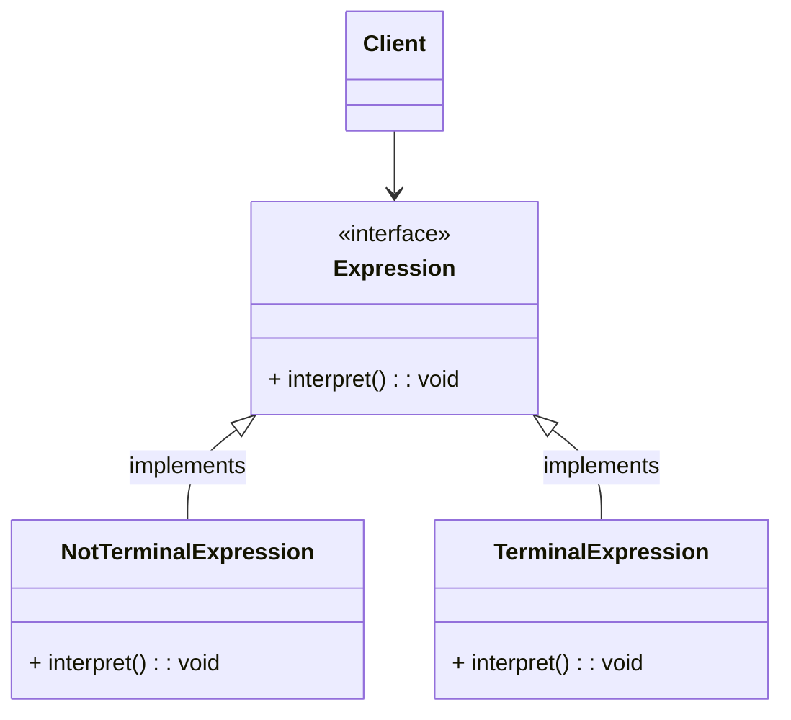

# 解释器模式

解释器模式(Interpreter)会针对某种语言并基于其语法特征创建一系列的表达式类（包括终极表达式与非终极表达式），利用树结构模式将表达式对象组装起来，最终将其翻译成计算机能够识别并执行的语义树。
解释器模式完美地对各种表达式进行拆分、抽象、关系化与多态化，定义出一个完备的语法构建框架，最终通过表达式的组装与递归调用完成对目标语言的解释。基于自相似性的树形结构构建的表达式模型使系统具备良好的代码易读性与可维护性，灵活多态的表达式也使系统的可扩展性得到全面提升。

