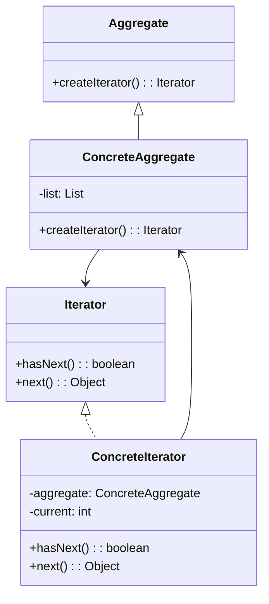

# 迭代器模式
于任何类型的集合，要防止内部机制不被暴露或破坏，以及确保用户对每个元素有足够的访问权限，迭代器模式起到了至关重要的作用。迭代器巧妙地利用了内部类的形式与集合类分离，然则“藕断丝连”，迭代器依然对其内部的元素保有访问权限，如此便促成了集合的完美封装，在此基础上还提供给用户一套标准的迭代器接口，使各种繁杂的遍历方式得以统一。迭代器模式的应用，能在内部事务不受干涉的前提下，保持一定的对外部开放。对于任何类型的集合，要防止内部机制不被暴露或破坏，以及确保用户对每个元素有足够的访问权限，迭代器模式起到了至关重要的作用。迭代器巧妙地利用了内部类的形式与集合类分离，然则“藕断丝连”，迭代器依然对其内部的元素保有访问权限，如此便促成了集合的完美封装，在此基础上还提供给用户一套标准的迭代器接口，使各种繁杂的遍历方式得以统一。迭代器模式的应用，能在内部事务不受干涉的前提下，保持一定的对外部开放。

## UML

在这个类图中，我们有四个类:
* Aggregate：定义了一个创建迭代器的方法的接口。
* ConcreteAggregate：实现了Aggregate接口并拥有一个待迭代的对象列表。
* Iterator：定义了用于迭代聚合对象中的元素的方法的接口。
* ConcreteIterator：实现了Iterator接口并提供了ConcreteAggregate中元素的迭代逻辑。