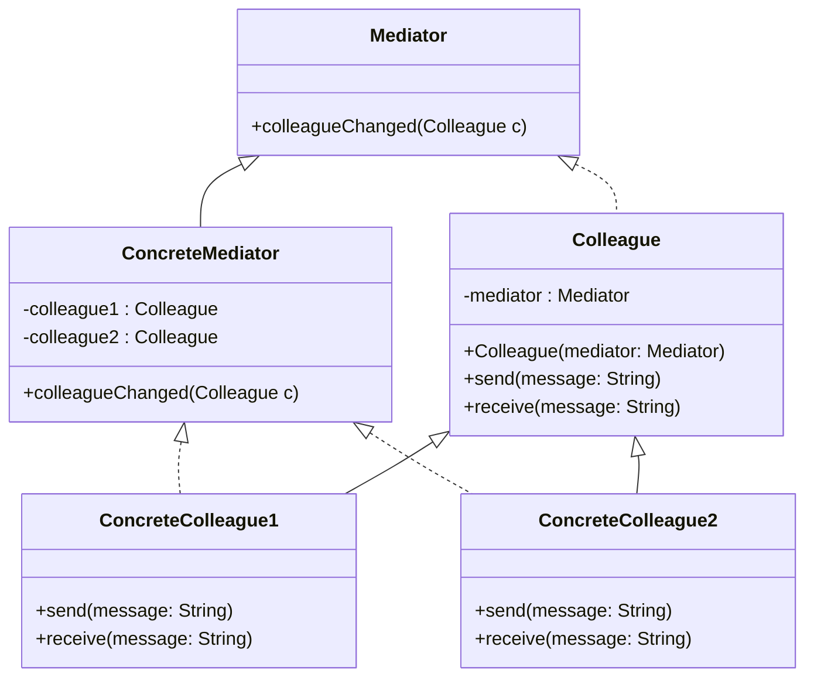

# 中介模式

中介是在事物之间传播信息的中间媒介。中介模式(Mediator)为对象构架出一个互动平台，通过减少对象间的依赖程度以达到解耦的目的。中介模式能将多方互动的工作交由中间平台去完成，解除了你中有我、我中有你的相互依赖，让各个模块之间的关系变得更加松散、独立，最终增强系统的可复用性与可扩展性，同时也使系统运行效率得到提升。

假设正在开发一款简单的游戏，玩家控制船并且在收集硬币时必须避开障碍物。 可以使用中介者模式来处理游戏不同部分之间的通信，例如玩家、障碍物和硬币。

