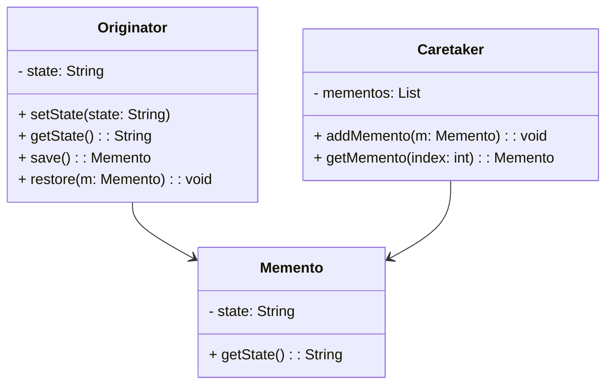

# 备忘录模式

备忘录用来记录曾经发生过的事情，使回溯历史变得切实可行。备忘录模式(Memento)则可以在不破坏元对象封装性的前提下捕获其在某些时刻的内部状态，并像历史快照一样将它们保留在元对象之外，以备恢复之用。备忘录类一定独立于元数据类而单独成类，其生成的历史记录也应该在元数据类之外进行维护，这样不但确保了元数据类的封装不被破坏，而且实现了对其内部状态历史变化的捕获与恢复。请参看备忘录模式的类结构。

