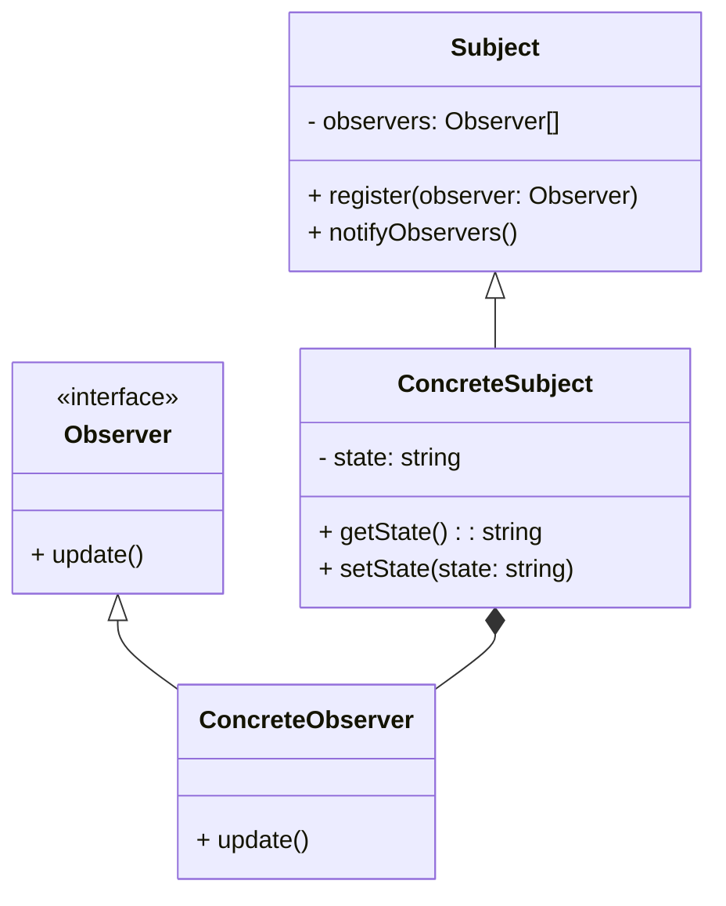

# 观察者模式

观察行为通常是一种为了对目标状态变化做出及时响应而采取的监控及调查活动。观察者模式(Observer)可以针对被观察对象与观察者对象之间一对多的依赖关系建立起一种行为自动触发机制，当被观察对象状态发生变化时主动对外发起广播，以通知所有观察者做出响应。

现实中的观察者(Observer)往往是主动方，这是由于目标主题(Subject)缺乏主观能动性造成的，其状态的更新并不能主动地通知观察者，这就造成观察行为的持续往复。而在软件设计中我们可以将目标主题作为主动方角色，将观察者反转为被动方角色，建立反向驱动式的消息响应机制，以此来避免做无用功，优化软件效率。

作为一种发布/订阅(publish/subscribe)式模型，观察者模式被大量应用于具有一对多关系对象结构的场景，它支持多个观察者订阅一个目标主题。一旦目标主题的状态发生变化，目标对象便主动进行广播，即刻对所有订阅者（观察者）发布全员消息通知。

