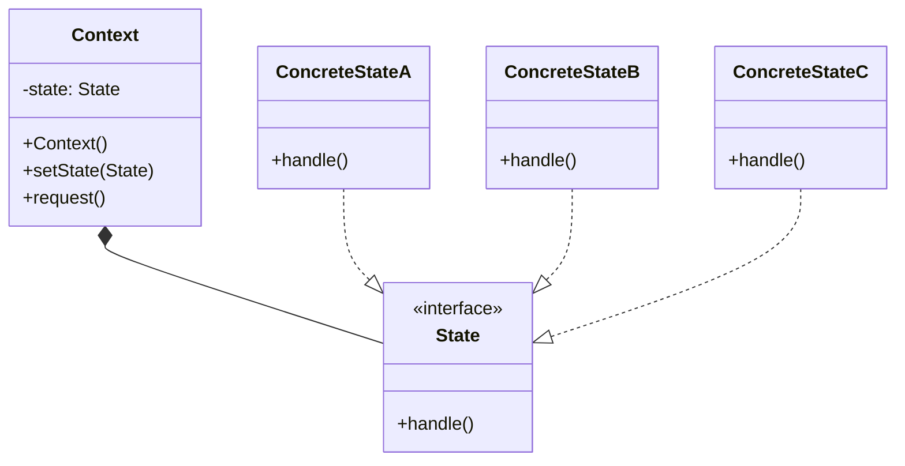

# 状态模式
状态指事物基于所处的状况、形态表现出的不同的行为特性。状态模式(State)构架出一套完备的事物内部状态转换机制，并将内部状态包裹起来且对外部不可见，使其行为能随其状态的改变而改变，同时简化了事物的复杂的状态变化逻辑。
从类结构上看，状态模式与策略模式非常类似，其不同之处在于，策略模式是将策略算法抽离出来并由外部注入，从而引发不同的系统行为，其可扩展性更好；而状态模式则将状态及其行为响应机制抽离出来，这能让系统状态与行为响应有更好的逻辑控制能力，并且实现系统状态主动式的自我转换。状态模式与策略模式的侧重点不同，所以适用于不同的场景。总之，如果系统中堆积着大量的状态判断语句，那么就可以考虑应用状态模式，它能让系统原本复杂的状态响应及维护逻辑变得异常简单。状态的解耦与分立让代码看起来更加清晰、明了，可读性大大增强，同时系统的运行效率与健壮性也能得到全面提升。

在本例中，我们使用状态模式实现了对武器不同状态的变化。

## UML

