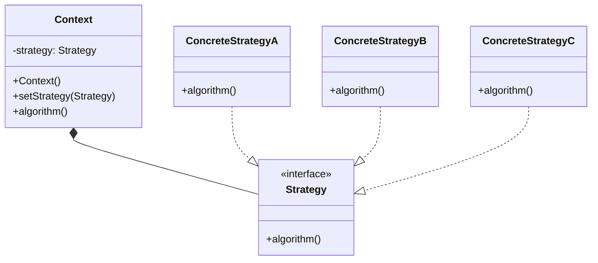

# 策略模式

策略模式(Strategy)强调的是行为的灵活切换，比如一个类的多个方法有着类似的行为接口，可以将它们抽离出来作为一系列策略类，在运行时灵活对接，变更其算法策略，以适应不同的场景。策略模式(Strategy)强调的是行为的灵活切换，比如一个类的多个方法有着类似的行为接口，可以将它们抽离出来作为一系列策略类，在运行时灵活对接，变更其算法策略，以适应不同的场景。

假设我们正在开发一款具有不同敌人类型的游戏，每种类型都有自己的一组攻击行为。当玩家遇到敌人时，游戏需要判断敌人正在使用哪种攻击行为并施加适当的伤害。
要处理这种情况，可以使用策略模式。您可以创建一组 EnemyAttackStrategy 对象，其中每个策略对应于特定的攻击行为。当玩家遇到敌人时，游戏需要判断敌人使用的是哪种攻击行为，并使用相应的策略来施加伤害。

## UML 类图

