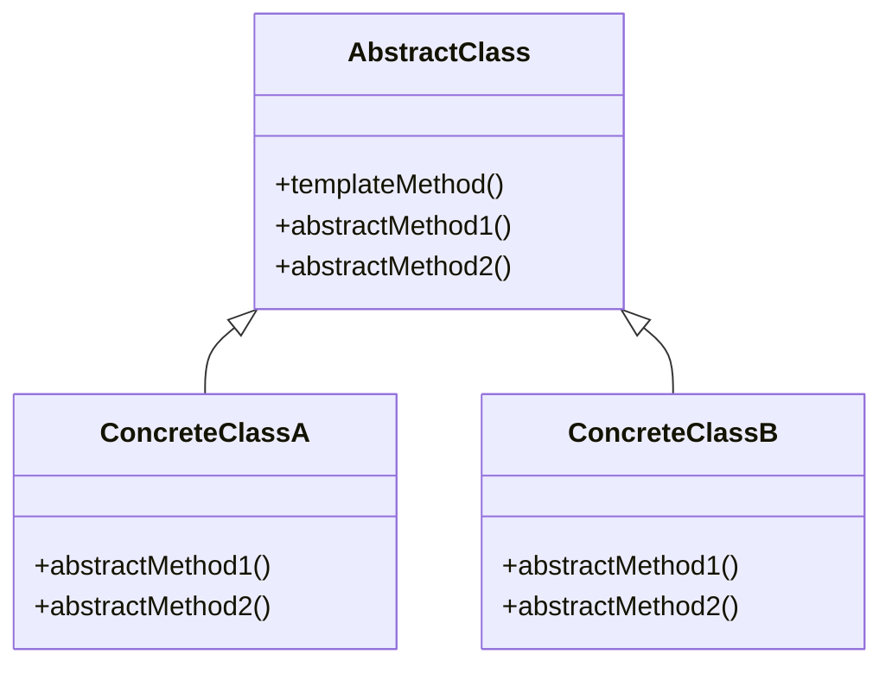

# 模板方法模式

模板是对多种事物的结构、形式、行为的模式化总结，而模板方法模式(Template Method)则是对一系列类行为（方法）的模式化。我们将总结出来的行为规律固化在基类中，对具体的行为实现则进行抽象化并交给子类去完成，如此便实现了子类对基类模板的套用。

这本例中，我们将角色攻击的过程抽象为模板，而具体的攻击方式则由子类去实现。这样，我们就可以在不改变模板的情况下，对角色的攻击方式进行扩展。

