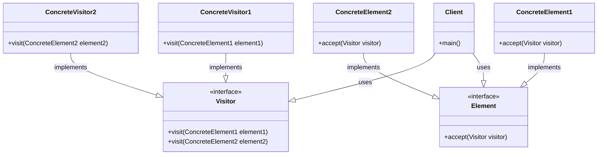

# 访问者模式

访问者模式(Visitor)主要解决的是数据与算法的耦合问题，尤其是在数据结构比较稳定，而算法多变的情况下。为了不“污染”数据本身，访问者模式会将多种算法独立归类，并在访问数据时根据数据类型自动切换到对应的算法，实现数据的自动响应机制，并且确保算法的自由扩展。

众所周知，对数据的封装，我们常常会用到POJO类，它除get和set方法之外不应包含任何业务逻辑，也就是说它只封装了一组数据且不具备任何数据处理能力，最常见的如做OR-Mapping时数据库表所对应的持久化对象(Persistent Object, PO)或转换后的值对象(Value Object, VO)。因为数据库是相对稳定的，所以这些POJO类亦是如此。反之，业务逻辑却是灵活多变的，所以通常我们不会将业务逻辑封装在这些数据类里面，而是交给专门的业务类(business service)（或者算法类）去处理。此时我们可以加入“访问者”模块，并根据不同类型的数据开展不同的业务，最终达到期望的响应结果。

访问者模式的核心在于对重载方法与双派发方式的利用，这是实现数据算法自动响应机制的关键所在。而对于其优秀算法的扩展是建立在稳定的数据基础之上的，对于数据多变的情况，我们就得对系统大动干戈了，所有的访问者重载方法都要被修改一遍，对于这种情况并不推荐使用访问者模式。

